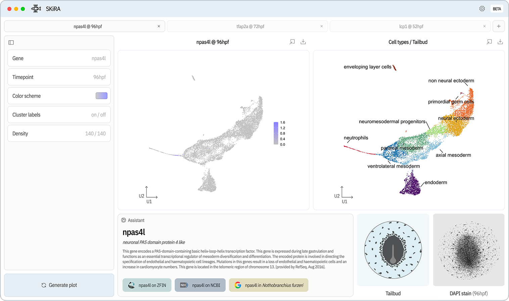

# 🧬 SKiRA
SKiRA (single cell killifish RNA atlas) is a comprehensive desktop application serving as a scRNA-seq atlas for African Turquoise Killifish _Nothobranchius furzeri_, providing a platform to analyze the gene expression, cell types and morphology during embryogenesis (52-115hpf)
<br></br>


### Key features
- Analyze individual gene expression in UMAP space
- View cell type clusters
- Define custom color schemes for expression
- View the embryonic morphology at each timepoint
- Export high fidelity plots in various formats (SVG, PNG, PDF)

### The dataset
Single cell RNA sequencing collected using PIP-seq at 52, 72, 96, 115 hours post fertilization from wild type (GRZ) _Nothobranchius furzeri_ embryos featuring a total of 28,795 cells with options to view each timepoint indiviudally along with a merged option combining all samples.

### Getting started

### Acknowledgements
Developed by Sebastian Hriscu featuring a dataset collected by Sydney Sattler 

[Abitua Lab](https://abitua.org) at the [University of Washington Department of Genome Sciences](https://gs.washington.edu)

### License
```
Copyright 2026 Sebastian Hriscu

Licensed under the Apache License, Version 2.0 (the "License");
you may not use this file except in compliance with the License.
You may obtain a copy of the License at

http://www.apache.org/licenses/LICENSE-2.0

Unless required by applicable law or agreed to in writing, software
distributed under the License is distributed on an "AS IS" BASIS,
WITHOUT WARRANTIES OR CONDITIONS OF ANY KIND, either express or implied.
See the License for the specific language governing permissions and
limitations under the License.
```
